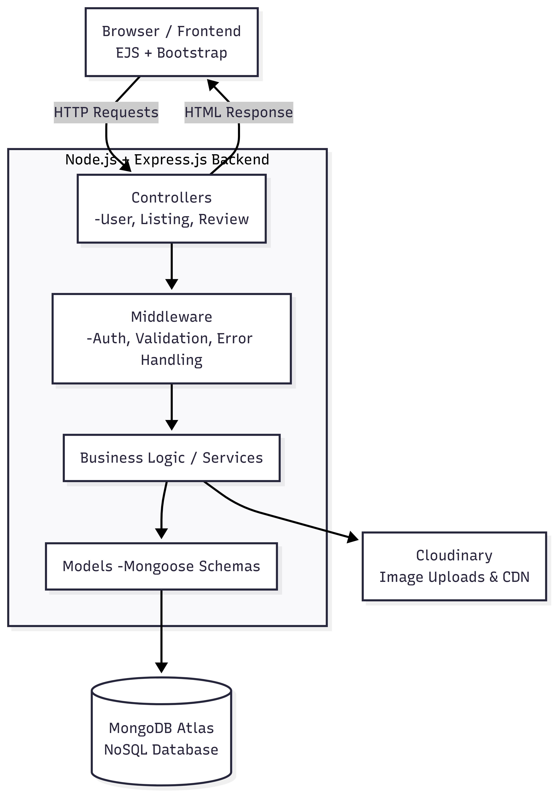
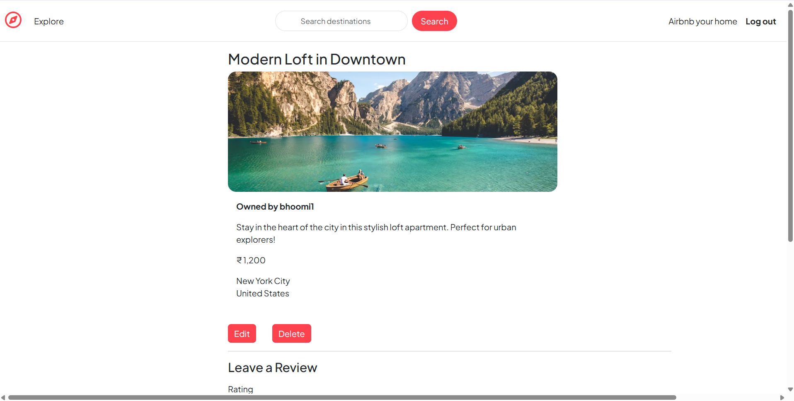

# WanderListing

WanderListing is a full-stack web application for managing property listings, similar to Airbnb. It allows users to create, view, edit, and delete property listings, add reviews, and interact with a responsive and interactive UI with map integration.

---

## Project Overview

The WanderListing project follows the **Model-View-Controller (MVC)** architectural pattern:

* **Models:** Represent the data and business logic (`Listing`, `Review`, `User`).
* **Views:** Handle the user interface and presentation (EJS templates).
* **Controllers:** Handle user input and coordinate interactions between the Model and View.

The backend is built with **Node.js** and **Express.js**, using **MongoDB** as the database with **Mongoose** ODM. Server-side rendering is done using **EJS templates**.

### 📊 High-Level Design (HLD)
<p align="center">
  
</p>
### 🔎 Low-Level Design (LLD)


---

## Tech Stack

* **Backend:** Node.js, Express.js
* **Database:** MongoDB (Atlas / Local)
* **Frontend:** EJS templates, HTML, CSS, Bootstrap
* **Authentication:** Passport.js, express-session, MongoStore

---

## Features

* **User Authentication:** Signup, login, logout
* **Listings CRUD:** Create, Read, Update, Delete listings
* **Reviews:** Users can add comments and ratings for listings
* **Image Uploads:** Photos uploaded to Cloudinary
* **Error Handling:** Custom error pages and flash messages
* **Secure Sessions:** Sessions persisted in MongoDB

---

## Getting Started

### Prerequisites

* Node.js (v18+ recommended)
* MongoDB (local or Atlas)
* npm / yarn

### Installation

1. Clone the repository:

   ```bash
   git clone <your-github-repo-link>
   cd wanderlisting
   ```
2. Install dependencies:

   ```bash
   npm install
   ```
3. Set up `.env` file with the following variables:

   ```env
   ATLASDB_URL=<your_mongo_atlas_url>
   CLOUDINARY_CLOUD_NAME=<your_cloudinary_cloud_name>
   CLOUDINARY_API_KEY=<your_cloudinary_api_key>
   CLOUDINARY_API_SECRET=<your_cloudinary_api_secret>
   SESSION_SECRET=<your_session_secret>
   MAPBOX_TOKEN=<your_mapbox_token>
   ```
4. Start the server:

   ```bash
   npm start
   ```
5. Visit the live deployed application:
   [WanderListing Live Demo](https://wanderlust-w2su.onrender.com/listings)

---

## Demo Screenshots

### Home Page


### Listing Details



## Project Workflow

1. **User Request:** Browser sends request to server
2. **Middleware:** Auth & validation checks
3. **Routing:** Request directed to appropriate router
4. **Controller:** Business logic executed
5. **Model:** Database interaction
6. **View:** EJS renders HTML
7. **Response:** HTML sent to browser

---

## License

This project is for educational purposes 
